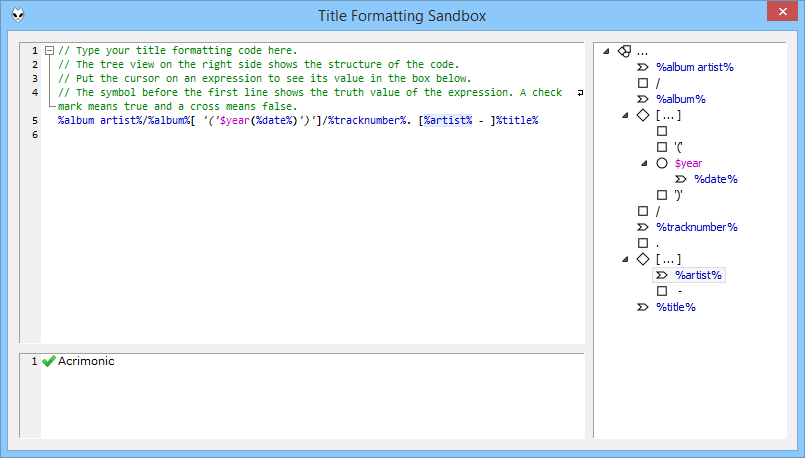

Title Formatting Sandbox
========================

Plugin for foobar2000 which provides an editor for title formatting scripts with syntax highlighting, a code structure view and preview for the selected script fragment.

Links
-----

* [foobar2000 home page](http://www.foobar2000.org/)
* [Title Formatting Sandbox](http://www.hydrogenaudio.org/forums/index.php?showtopic=TODO) on the foobar2000 forum
* [Fugue Icons by Yusuke Kamiyamane](http://p.yusukekamiyamane.com/)
* [Scintilla editor component by Neil Hodgson](http://www.scintillia.org/)
